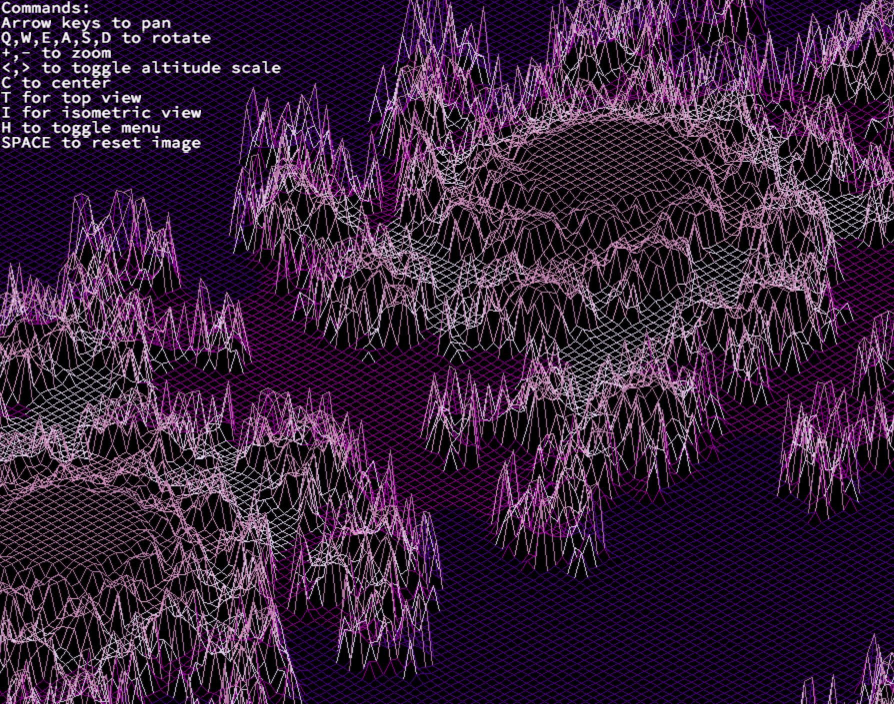

# FDF
FdF (Fil de Fer) is a 42 project that involves creating a 3D wireframe representation of a landscape.  
The goal is to parse a file containing height values and display the landscape using the graphical capabilities of your machine.

  

## Features
Display a 3D wireframe representation of a landscape  
Support for different colors based on height  
Basic user controls for navigation and zooming

## Prerequisites
Before running FdF, make sure you have the following installed on your machine:

- GCC (https://gcc.gnu.org/) or any other C compiler
- MinilibX (https://github.com/42Paris/minilibx-linux) library

## Installation
1. Clone the repository  
`git clone https://github.com/MariamElSahhar/fdf.git`  
2. Compile the project  
`cd fdf; make`

## Usage
Run the program using  
` ./fdf map_file `  

## Controls
- Arrow keys: move the landscape
- '+' and '-': Zoom in and out
- 'A', 'S', 'Q', 'W', 'Z', 'X': Rotations
- 'ESC': Exit the program

## Resources
FdF Subject (https://github.com/fpetras/42-subjects/blob/master/fdf.en.pdf) - project subject and requirements
